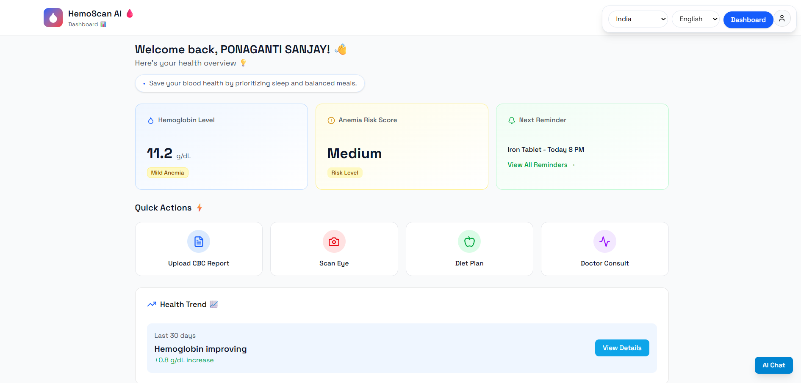

# HemoScan AI - Anemia Detection and Risk Analysis

Generative AI powered web platform for non-invasive anemia screening, CBC report analysis, personalized diet guidance, and multilingual health education.

## Table of Contents
1. [About](#about)
2. [Website Overview](#website-overview)
3. [Key Features](#key-features)
4. [Screenshots](#screenshots)
5. [Tech Stack](#tech-stack)
6. [Run Frontend](#run-frontend)
7. [Run Backend](#run-backend)

## About
HemoScan AI combines AI-assisted screening, OCR-based CBC extraction, and explainable summaries to help users understand anemia risk and take action. The experience focuses on accessibility, prevention, and guided care.

## Website Overview
HemoScan AI is designed as a generative AI healthcare companion for anemia detection and follow-up guidance. It supports multiple data inputs (CBC, non-invasive eye scan, and symptoms), generates personalized nutrition guidance, and provides clear explanations with translation support for regional languages. The UI emphasizes quick actions, clinical clarity, and a smooth path from screening to consultation.

## Key Features
- **Generative AI summaries** for CBC and scan results
- **AI chatbot** for report explanations and next steps
- **Personalized diet plans** with translation
- **Non-invasive eye scan** workflow (camera + upload)
- **Doctor consultation** and reminders
- **Awareness and guidelines** for public health outreach

## Screenshots

### Generative AI Features


### Dashboard


### Retina Scan


### Doctor Consultation


### Diet Planner


### Awareness and Guidelines


## Tech Stack
- **Frontend:** React (Vite), Tailwind, ShadCN UI
- **Backend:** FastAPI
- **AI/ML:** Scikit-learn, TensorFlow/TFLite (planned), CNN (MobileNet/EfficientNet)
- **OCR:** Tesseract + PDF support
- **Database:** MongoDB

## Run Frontend
```bash
npm i
npm run dev
```

## Run Backend
```bash
cd backend
python -m venv .venv
.\.venv\Scripts\python -m pip install -r requirements.txt
.\.venv\Scripts\uvicorn app.main:app --reload --port 8000
```
